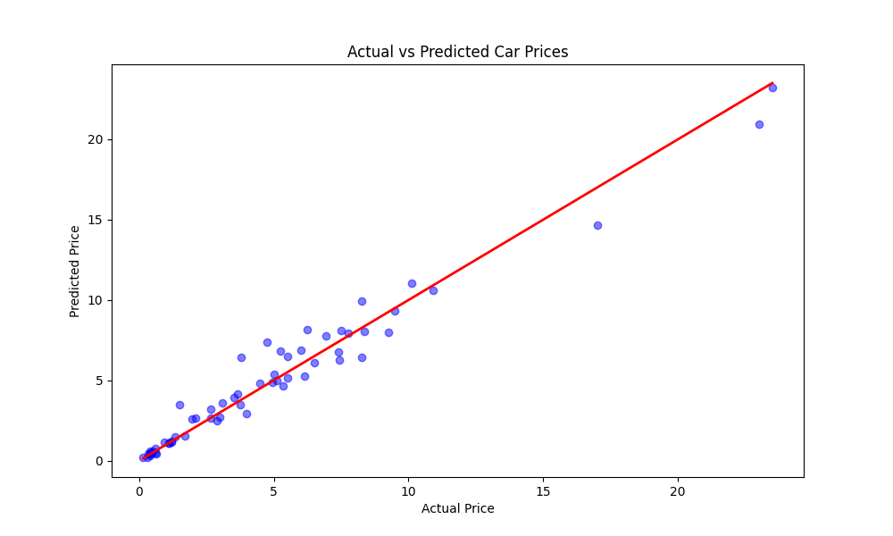

# Car Price Prediction using Machine Learning

## CodeAlpha Data Science Internship — Task 3

### Project Overview
A machine learning model designed to predict the selling price of used cars based on various features such as brand, age, mileage, and fuel type.

### Dataset
* **Source:** Car price prediction Dataset (provided by CodeAlpha)
* **Features:** Year, Present Price, Kms Driven, Fuel Type, Selling Type, Transmission, Owner.
* **Target:** Selling Price

### Steps Performed
1. **Data Loading:** Handled CSV data using Pandas.
2. **Preprocessing:** - Calculated `Car_Age` to represent the car's age.
   - Encoded categorical features (Fuel Type, Transmission, etc.) into numeric values.
3. **Model Selection:** Used **Random Forest Regressor** for its high accuracy and robustness.
4. **Evaluation:** Achieved a high R2 score, indicating a very reliable model.

### Results
* **Model R2 Score:** 0.9625
* **Accuracy:** 96.26%

### Libraries Used
* Pandas & NumPy
* Scikit-learn
* Matplotlib & Seaborn
